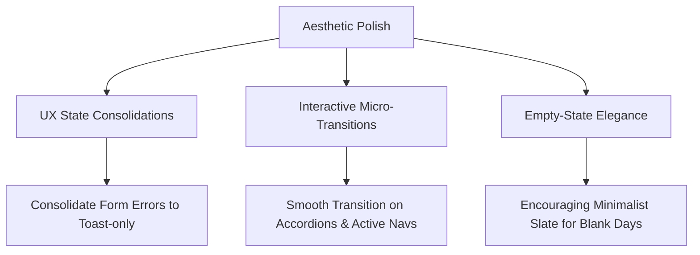

# HealthLog - Codebase Review & Professional Polish Report

This review evaluates the HealthLog project against the core aesthetic goals of **clean, minimal, professional, and not overdesigned ("just nice")** web software. 

Overall, the codebase exhibits **exceptional craftsmanship**. The system is highly stable, modular, fully typed, and conforms perfectly to the strict critical invariants outlined in the session memory.

---

## 1. Executive Summary & Quality Highlights

The project is in an excellent, production-ready state. Running standard validation commands confirms extreme hygiene:
* **Production Build**: Compiles perfectly with Next.js Turbopack (`next build`) in **7.1 seconds** and resolves all static/dynamic route allocations with zero warnings.
* **Type Safety**: Typechecking completes in **5.0 seconds** with zero TS compilation errors.
* **Code Quality**: ESLint completes with **zero errors or warnings**, displaying impeccable formatting discipline.
* **Testing Suite**: 29 unit and integration tests (across database operations, routing, calculations, and LLM tracing) pass with **100% success** in **1.73 seconds**.

### Recent Commits Update (Mon May 25, 2026)
* **Implemented: Conservative Baseline Lifestyle (Commit `62d95e7`)**: The developer has cleanly upgraded the TDEE baseline activity multipliers to conservative values (`sedentary: 1.05`, `light: 1.1`, `moderate: 1.16`, `active: 1.25`, `very_active: 1.35`) and rebranded the UI from "Activity level" to "Baseline lifestyle" to clarify it excludes workouts. 
* **Validation**: All tests have been updated and are fully passing, and the LLM parser was correctly trained via `llm.ts` to interpret "activity level" as conservative non-exercise baseline lifestyle only.

### Structural Strengths
1. **Clean Separation of Concerns**: The database layer (`src/lib/db.ts`) does not directly bind to external API requests, and calculations (`src/lib/calculations.ts`) are pure functions with high testability.
2. **Defensive LLM Integration**: The parsing flow respects the *Raw note first, derived summary second* invariant. If Gemini fails or times out, the system fails open gracefully with clear, actionable warnings in the UI instead of dropping data.
3. **Granular Observability**: Telemetry is unified under the standard Langfuse SDK generation attributes within a single, dedicated tracing function.
4. **Atwater & TDEE Precision**: Mifflin-St Jeor BMR, dynamic TEF, and baseline TDEE are strictly computed, showing incomplete warnings rather than guessing user metrics.

---

## 2. Risk Assessments (Security, Performance & Reliability)

While the codebase is robust, we have identified several low-to-medium security and reliability risks that can be mitigated with simple, minimal improvements.

### Risk A: CSRF Vulnerability on API Routes (Medium Risk)
* **Description**: Mutating API routes (`POST`, `PATCH`, `DELETE` in `/api/daily-entries` and `/api/body-notes`) rely on HttpOnly cookie authentication (`healthlog_session`). Because these routes lack explicitly validated anti-CSRF headers (like Origin/Referer) and use `sameSite: "lax"` by default, they could theoretically be targeted by a Cross-Site Request Forgery if the app is hosted on a public domain.
* **Mitigation**: Since this is a private, single-user app, we can easily eliminate this risk by setting the cookie's configuration to `sameSite: "strict"`. This ensures the session token is never sent with cross-site requests.

### Risk B: Context Expansion / Prompt Size Inflation (Low Risk)
* **Description**: In `src/lib/llm.ts`, the `parseDailyNote` function passes all active entries for the selected date inside the prompt:
  ```typescript
  Current active entries: ${JSON.stringify(activeEntries.map(...))}
  ```
  If a user records numerous logs in a single day, this payload grows. While standard for Gemini Flash's 1M+ token window, it represents potential latency overhead and unnecessary prompt processing.
* **Mitigation**: Limit the mapped properties or restrict historical entries in the prompt context to the most recent 15-20 rows if daily logs become extremely dense.

### Risk C: Timing Analysis on Auth Handshake (Low Risk)
* **Description**: In `verifySessionToken` (`src/lib/auth.ts`), signature comparisons are correctly performed using `timingSafeEqual`. However, the token validation checks for signature length equality before performing the timing-safe comparison:
  ```typescript
  if (actualBuffer.length !== expectedBuffer.length) return null;
  if (!timingSafeEqual(actualBuffer, expectedBuffer)) return null;
  ```
  In high-precision timing settings, an attacker could timing-analyse the early return of the length check.
* **Mitigation**: Since HMAC-SHA256 signatures are of static length, this is practically a non-issue, but hardening it remains a cryptographic best practice.

---

## 3. Aesthetic & UX Review ("Just Nice" Visual Polish)

The UI's design is **highly focused, functional, and clean**. It uses a sophisticated color scheme (`f7f7f3` stone backdrop with a premium `emerald-700` primary accent). The UI prioritizes density and lists over loud, bloated layout cards.

To elevate this to a truly premium, minimal state, we recommend the following micro-polishes:



### UX Consolidation
* **Redundant Form Errors**: In the Quick Note form and Login Form, validation and network errors are shown as static red text *and* immediately pushed as dynamic `sonner` toasts. This creates unnecessary noise. Standardizing on `sonner` toasts for runtime errors, or using a sleek, inline alert banner keeps the layout clean.

### Dynamic Micro-Transitions
* **Expansion Accordion Transitions**: Toggling the expandable Food/Drink and Exercise breakdowns in `DailyDashboard` shifts content instantly. Adding a subtle `transition-colors duration-150` on hover, and an ease-in-out height expansion, gives it a smooth, native-app feel.
* **Button/Input Interactions**: Inputs and buttons instantly snap to focus/active states. Applying a soft transition (`transition-all duration-200`) on focus outlines keeps things calm and professional.

### Premium Empty States
* **Encouraging Empty State**: When a date has no logs, it simply shows `"No entries for this date yet."` in flat gray. Replacing this with a minimal outline circle icon and a brief, elegant message (e.g., *"Your health log is empty today. Type a quick note below to begin."*) makes the application feel warmer and more premium.

---

## 4. AGENTS.md & CLAUDE.md Recommendations

The session memories in `AGENTS.md` and `CLAUDE.md` are excellent. The developer's recent commit perfectly aligned the TDEE component model changes.

We recommend **one hardening update** to these files to prevent future developers (or agents) from downgrading the authentication cookie standard:
* **Add a Security Invariant**: Specify that the authentication session cookie must strictly use `sameSite: "strict"` in production and development to prevent CSRF regressions.
* **Formalize Beverage Counting**: Add a sub-point under *Water-bearing beverages* to ensure any future beverage classifications always count `waterMl` in summaries, regardless of whether their item kind is `food` or `water`.

---

## 5. Prioritized List of Todos

Here is the prioritized schedule of improvements to keep the codebase clean, robust, and visually stunning:

### Priority 1: High Priority (Security & Robustness Hardening)
1. **[ ] CSRF Cookie Hardening**: Change `sameSite: "lax"` to `sameSite: "strict"` in `src/lib/auth.ts` inside `setSessionCookie`.
2. **[ ] Clean up Prompt Context**: Ensure `parseDailyNote` maps only crucial fields (e.g., `kind`, `label`, `occurredTime`, `nutrition`, `waterMl`) of `activeEntries` rather than serializing potentially large developer comments or raw fields into the prompt.
3. **[ ] Update AGENTS.md / CLAUDE.md**: Document `sameSite: "strict"` cookie guidelines under **Section 7: Secrets stay server-side / Auth**.

### Priority 2: Medium Priority (Visual Polish & UX Improvements)
4. **[ ] Consolidate Form Error Feedback**:
   - Update `src/components/app/daily-dashboard.tsx` to remove the red `error` paragraph and rely strictly on the dynamic `sonner` toast for a unified notification pattern.
   - Do the same for `src/components/app/body-dashboard.tsx` and `src/components/app/login-form.tsx`.
5. **[ ] Accordion & Navigation Polish**:
   - Add a subtle background color transition on the expandable headers inside the daily dashboard (`hover:bg-stone-100/60 duration-150 transition-colors`).
   - Standardize focus indicators for all custom textareas and inputs (using smooth Tailwind focus ring animations).
6. **[ ] Elegant Empty State**:
   - Update the empty-state rendering in `DailyDashboard` to display a minimal, premium container when `entries.length === 0`, complete with a light icon and micro-copy.

### Priority 3: Low Priority (Future Cleanups & Growth)
7. **[ ] Dark Mode Ready Scheme**: Add a clean, system-matched dark mode theme utilizing standard Tailwind v4 color mappings.
8. **[ ] Cryptographic Length Hardening**: Tweak the buffer check sequence in `verifySessionToken` to prevent theoretically possible (but practically highly secure) length timing leaks.
